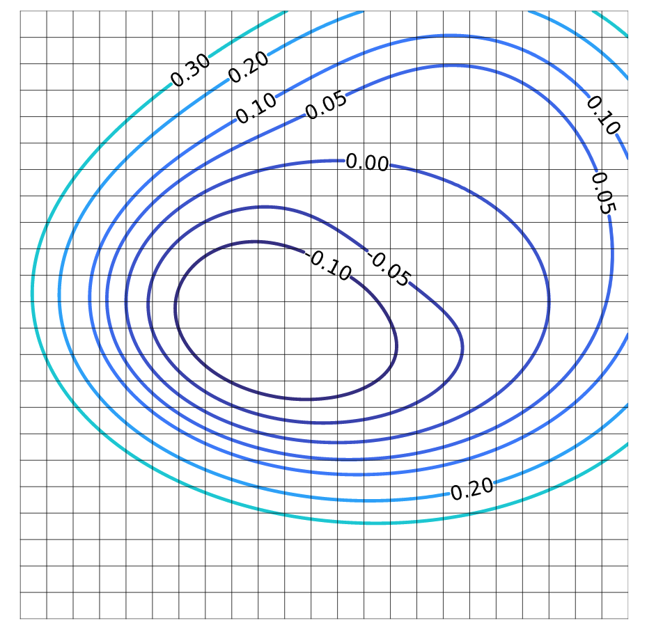
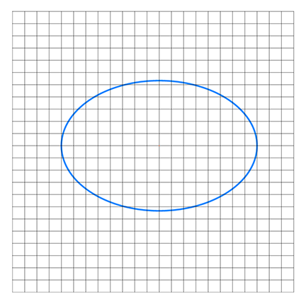
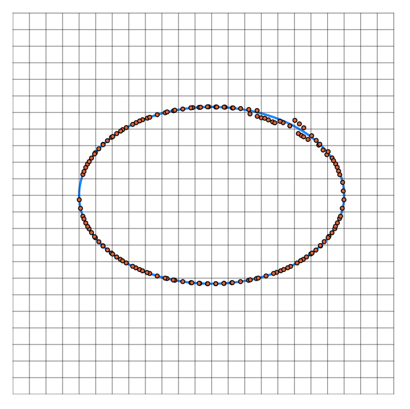
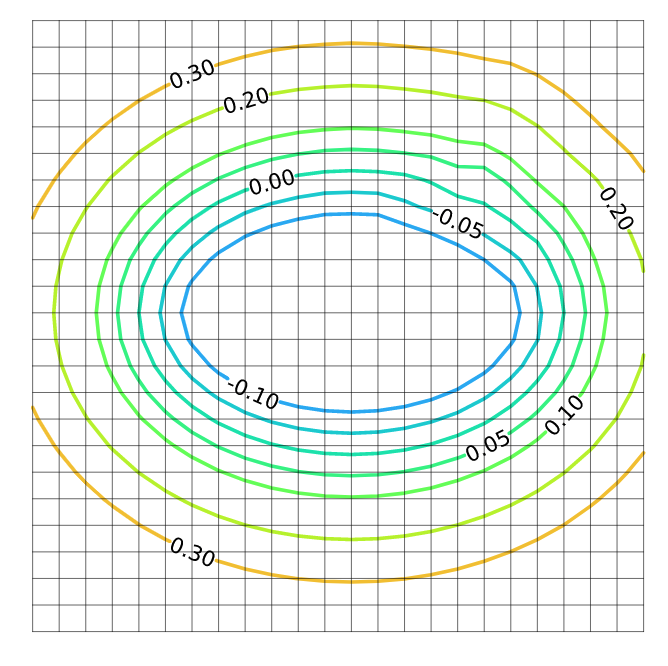

#  High Order Reinitialization

This package mainly implements the 2D reinitialization method proposed by [Saye(2014)](dx.doi.org/10.2140/camcos.2014.9.107). It also wraps some useful functions for       implicit surface representation and the evolution calculation.
  
## About implicit surfaces and reinitialization

An implicit surface is usually defined by a level set of a continuous function $\phi: \mathbb{R}^d \rightarrow \mathbb{R}$, where $\phi$ maps a point in the $d$- dimension Euclidean space to a scalar value, with the curve/surface defined as the set of points where $\phi(\mathbf{x}) = 0$. 

Reinitialization/Redistancing is a process that is used to redefine the level set function of an implicit surface to be a signed distance function (SDF). An SDF is a scalar field that assigns to each point in space the distance to the nearest point on the surface of the object, with positive values inside the object and negative values outside.

## Code structure

`\src` includes all the source code:
-  `ClosestPoint.jl` includes functions to find the closest point on the implicit surface to the query points.
-  `Evolve.jl` includes functions required for solving the evolution equation for implicit surfaces.
-  `Grids.jl` includes functions to setup a Cartesian grid.
-  `HighOrderReinitialization.jl` wraps up all the functions into a module.
-  `InterfaceSample.jl` samples a point cloud on the implicit surface.
-  `PiecewiseApprox.jl` includes functions to do polynomial approximation for the cells covering the surface.
-  `Plots.jl` wraps up some functions for plotting, including plot surface/contour from a function or from a field.

`\examples` includes an example of a rotating circle with slot.

`\test` includes the general usage and an accuracy test.
  
## To do

This package still have some drawbacks to fix and some features to add:

- The algorithm is not good at reinitializing sharp corners.
- The discretization and integration method for the evolution equation is naive.
- The frequency of using the reinitialization method is uncertain.
- The package only allow for uniform grid, I plan to extend it to non-uniform grid.
- The package currently can only do 2D reinitialization. I plan to extend it to 3D.

## Tutorial

To activate the package:

```julia
] activate /path/to/the/package
```

To use the package:

```julia
using HighOrderReinitialization
```

All the functions in this package is based on a Cartesian background grid, so we need to first set up the grid:

```julia
# 24 × 24 Cartesian grid, length from -3/4 to 3/4
grid = Grid((24,24), (-3/4,3/4))
```

Given a function for implicit surface, we could plot it or plot the contour:

```julia
f(x) = (1-exp(-(x[1]-0.3)^2 - (x[2]-0.3)^2))*(sqrt(4*x[1]^2+9*x[2]^2)-1)

# plot the contour
levels = [-0.1, -0.05, 0, 0.05, 0.1, 0.2, 0.3]
level_set_contour(grid,f,levels=levels, show_grid = true, clabels=true)
```



```julia
# plot the surface
implicit_plot_2D(grid,f)
```



We can also plot the surface/contour from a scalar field:

```julia
# generate the level set field
ϕ = set_field(grid,f)
# plot the contour
field_contour(grid,ϕ,levels=levels, show_grid = true, clabels=true)
# plot the surface
field_contour(grid,ϕ,levels=[0], show_grid = true, clabels=false)
```

For the reinitialization, first we generate polynomial approximation for the cells covering the surface (Note for Taylor degree 2 and 3, we need at least one layer of cell outside the surface, for Taylor degree 4 and 5, we need two layers):

```julia
# cell_index labels the lower-left point of the cell
# X collects all the points used for polynomials 
# C collects all the polynomial coefficients
# 3 indicates Taylor degree 2 (expects 3rd order)
cell_index, X, C = cal_coeff_2D(grid,ϕ,3)
```

Then we sample a point cloud:

```julia
# clouds collects the point cloud
# Cell_num record collects the labels of corresponding cells
clouds, Cell_num = sample_2D(cell_index, C, 3, grid)
# Could plot the figure to check the sampled points:
implicit_plot_2D(grid,f, dataset=clouds, markersize = 2)
```



Finally we find the closest points for query points:

```julia
ϕ_new = closest_point_2D(clouds, Cell_num, C, 3, ϕ, grid)
# plot the contour
field_contour(grid,ϕ_new,levels=levels, clabels=true)
```



These steps are also wrapped up in one function. Given the grid and the initial level set field:

```julia
# The expected order of accuracy, use Taylor degree p-1
p = 3 
reinitialization_2D(ϕ, grid, p)
```

